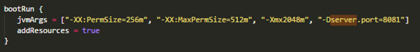
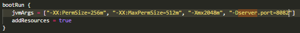
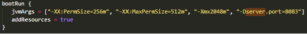

##########################################################
How to running multiple projects in one server localhost
##########################################################

On bolalob, we have several projects that are bolalob sites, bolalob TV and bolalob SI.
If we want running the project together on localhost, first you should setup the file build.gradle for example:

a. Open file ``build.gradle`` bolalob-sites, edit file setup and change the number of ``server.port``. 

   build gradle, setup port for bolalob sites.

b. Open file ``build.gradle`` bolalob-TV, edit file setup and change the number of ``server.port``.

    build gradle, setup port for bolalob tv.

c. Open file ``build.gradle`` bolalob-SI, edit file setup and change the number of ``server.port``.

    build gradle, setup port for bolalob SI.

.. note::
    Lorem ipsum dolor sit amet, consectetur adipiscing elit. Aliquam sodales mi et neque pharetra, sit amet volutpat odio aliquam. Suspendisse at sollicitudin erat.

.. warning::
    Lorem ipsum dolor sit amet, consectetur adipiscing elit. Aliquam sodales mi et neque pharetra, sit amet volutpat odio aliquam. Suspendisse at sollicitudin erat. 

.. danger::
    Lorem ipsum dolor sit amet, consectetur adipiscing elit. Aliquam sodales mi et neque pharetra, sit amet volutpat odio aliquam. Suspendisse at sollicitudin erat. 
