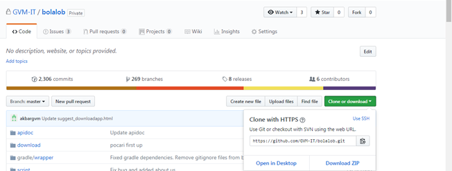

##########################################
How to running project in your localhost
##########################################

If you have been installing several Prerequisite previously which is explained on the above, for running the project in the localhost, follow this step will be explained as such:

1.  Firstly you should sign into your GitHub account, for clone or download the project bolalob which is in Github.

2.  After success sign into your GitHub, clone the project you will running in localhost with way copy the link url from github. 
3.  After you copy link URL from Github, please open your git or command line.
4.  Sign in to your command line or git, and typing the command line this for make a folder.

.. line_code:

.. code:: javascript

            $ mkdir folder_name

5.  And typing this command for navigate to your folder previously you create.

.. line_code:

.. code:: javascript

            $ cd d:\folder_name

6.  After you have make a folder for your project, Typing this command on your git. For download or clone the project to your computer.

.. line_code:

.. code:: javascript

            $ git clone URL_link_from_github

7.  And after success to clone you project to your computer, for remote the project localhost with project live in github you can type your command as such:

.. line_code:

.. code:: javascript

            $ git remote add origin URL_link_from_github

8.  After successfully clone the project you should setup and Input files ``application.properties`` in your project. 
9.  After you have been finding the file folder project and setup ``application.properties``, next you can type the command line this for running the project in your server localhost.

.. line_code:

.. code:: javascript

            $ gradle clean bootRun

10. If success, once you type command previously the gradle can be processed and appearing where your project run. Example the project run on ``https://localhost:8000/`` it is projected running on localhost with ``port 8000``.
11. You can type the URL link in your browser.

.. note::
    Lorem ipsum dolor sit amet, consectetur adipiscing elit. Aliquam sodales mi et neque pharetra, sit amet volutpat odio aliquam. Suspendisse at sollicitudin erat.

.. warning::
    Lorem ipsum dolor sit amet, consectetur adipiscing elit. Aliquam sodales mi et neque pharetra, sit amet volutpat odio aliquam. Suspendisse at sollicitudin erat. 

.. danger::
    Lorem ipsum dolor sit amet, consectetur adipiscing elit. Aliquam sodales mi et neque pharetra, sit amet volutpat odio aliquam. Suspendisse at sollicitudin erat. 
